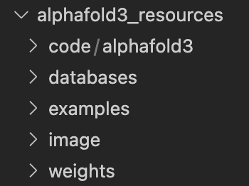

# AlphaFold3 on HPC

<h3 align="right">Colby T. Ford, Ph.D.</h3>

<p align="middle">Steps for running AlphaFold3 in a container on an HPC cluster environment.</p>

**Blog Post:** https://blog.colbyford.com/running-alphafold3-at-scale-on-high-performance-computing-clusters-82764a6b809e

## Setup

Create an `alphafold3_resources` folder on the cluster with the following subfolders: `code`, `databases`, `image` `weights`.

```bash
mkdir code databases image weights
```



### Filling in the Folders

1. For the `code/` folder, clone the AlphaFold3 repository. This will give you the scripts to actually run the AlphaFold3 process.

```bash
git clone https://github.com/google-deepmind/alphafold3.git ./code/alphafold3
```

2. In the `databases/` folder, run the `fetch_databases.py` script that was cloned from the GitHub repository.

```bash
python ./code/alphafold3/fetch_databases.py --download_destination ./databases
```

3. In the `image/` folder, you will need to generate a Singularity/Apptainer image from the prebuilt Docker image hosted on DockerHub.

```bash
module load singularity

singularity pull ./image/alphafold3.sif docker://cford38/alphafold3
```


4. In the `weights/` folder, you'll need to request the model parameters using [this form](https://forms.gle/svvpY4u2jsHEwWYS6). Once they send you the link to the weights, you can download them using the following command. Not that there are restrictions as to how the model can be used.

```bash
wget -P ./weights/ https://storage.googleapis.com/alphafold3/models/64/<your_key>/af3.bin.zst
```


## Running AlphaFold3

1. Next, create a script to run your folding process in SLURM. Using environment variables, you will point to the various resources (the database, weights, etc.) that you previously set up. An example `submit.sh` script is below (but you'll need to modify the header and paths for your HPC system).

```bash
#!/bin/bash
#SBATCH --job-name="af3_test"
#SBATCH --partition=GPU
#SBATCH --nodes=1
#SBATCH --ntasks-per-node=32
#SBATCH --mem=256GB
#SBATCH --gres=gpu:L40S:2
#SBATCH --time=1:00:00

module load singularity

export AF3_RESOURCES_DIR=/users/cford/alphafold3_resources

export AF3_IMAGE=${AF3_RESOURCES_DIR}/image/alphafold3.sif
export AF3_CODE_DIR=${AF3_RESOURCES_DIR}/code
export AF3_INPUT_DIR=${AF3_RESOURCES_DIR}/examples/fold_protein_2PV7
export AF3_OUTPUT_DIR=${AF3_RESOURCES_DIR}/examples/fold_protein_2PV7/output
export AF3_MODEL_PARAMETERS_DIR=${AF3_RESOURCES_DIR}/weights
export AF3_DATABASES_DIR=${AF3_RESOURCES_DIR}/databases

singularity exec \
     --nv \
     --bind $AF3_INPUT_DIR:/root/af_input \
     --bind $AF3_OUTPUT_DIR:/root/af_output \
     --bind $AF3_MODEL_PARAMETERS_DIR:/root/models \
     --bind $AF3_DATABASES_DIR:/root/public_databases \
     $AF3_IMAGE \
     python ${AF3_CODE_DIR}/alphafold3/run_alphafold.py \
     --json_path=/root/af_input/alphafold_input.json \
     --model_dir=/root/models \
     --db_dir=/root/public_databases \
     --output_dir=/root/af_output
```


Lastly, you can submit the job using the following command.

```bash
sbatch submit.sh
```


## AlphaFold3 JSON Files

AlphaFold3 runs using JSON files that are a specific format. An example `alphafold_input.json` file is shown below.

```json
{
  "name": "5tgy",
  "modelSeeds": [
    1234
  ],
  "sequences": [
    {
      "protein": {
        "id": "A",
        "sequence": "SEFEKLRQTGDELVQAFQRLREIFDKGDDDSLEQVLEEIEELIQKHRQLFDNRQEAADTEAAKQGDQWVQLFQRFREAIDKGDKDSLEQLLEELEQALQKIRELAEKKN"
      }
    },
    {
      "ligand": {
        "id": "B",
        "ccdCodes": [
          "7BU"
        ]
      }
    }
  ],
  "dialect": "alphafold3",
  "version": 1
}
```

Other example files are in the [`examples/`](examples/) folder in this repository.

## Resources

- AlphaFold3 Repository: https://github.com/google-deepmind/alphafold3
- UNC Charlotte HPC Guide on GPU Jobs: https://oneit.charlotte.edu/urc/research-clusters/orion-gpu-slurm-user-notes/#:~:text=SUBMITTING%20A%20GPU%20JOB
- SLURM Command Reference: https://slurm.schedmd.com/pdfs/summary.pdf
